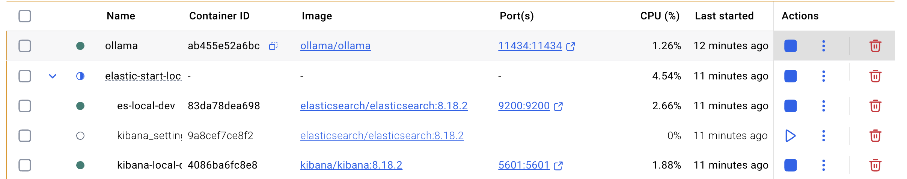

# 🧠 Ollama + Elasticsearch RAG Starter

This repository connects [Ollama](https://ollama.com) with [Elasticsearch + Kibana](https://elastic.co) to support **OpenAI-compatible RAG (Retrieval-Augmented Generation)** experiments locally. It uses a shared Docker network to enable seamless integration between the LLM runtime and the Elastic Stack.

---

## 🚀 Quick Start

```bash
# 1. Clone this repository
git clone https://github.com/Som23Git/ollama_plus_elasticsearch_kibana.git
cd ollama_plus_elasticsearch_kibana

# 2. Start Ollama with model selection (e.g., mistral or deepseek)
chmod +x start-ollama.sh
./start-ollama.sh

# 3. Install and start Elasticsearch + Kibana (first time only)
curl -fsSL https://elastic.co/start-local | sh -s -- -v 8.18.2

# 4. If already installed, start the services
cd elastic-start-local
chmod +x start.sh
./start.sh

# 5. Check network connectivity from host or containers
chmod +x network-check.sh
./network-check.sh

# 6. Once Elasticsearch, Kibana is online, start the ingestion
chmod +x ingest_alice_book.sh
./ingest_alice_book.sh

# 7. Jump to the Kibana Playground and add Connectors to ask questions.
```

---

### ✅ Expected Output

```text
🌐 Checking connectivity to http://localhost:11434/v1/chat/completions
⏳ Sending test prompt to mistral...
✅ Ollama responded successfully!
🧠 Model response:
"A vector database is a type of database designed specifically for storing, indexing, and querying large collections of data vectors..."
```

---

## 🐳 Docker Container Setup

This setup ensures all containers (Ollama, Elasticsearch, Kibana) run in a **shared Docker network** named `rag-network`.



Inspired by:
🔗 [Testing DeepSeek R1 locally for RAG with Ollama and Kibana – Elasticsearch Labs](https://www.elastic.co/search-labs/blog/deepseek-rag-ollama-playground)

---

## 📝 License

This project is licensed under the [MIT License](./LICENSE).

---

## 📚 Public Domain Data Attribution

This repository uses public domain content for RAG demos:

* **Title**: *Alice’s Adventures in Wonderland*
* **Blob**: [*Check here*](https://www.gutenberg.org/cache/epub/11/pg11.txt)
* **Author**: Lewis Carroll
* **Source**: [Project Gutenberg](https://www.gutenberg.org/ebooks/11)
* **License**: Public Domain (U.S.)

> As per [Project Gutenberg™ License](https://www.gutenberg.org/license), this work is freely usable in the U.S. The text file was stripped of all Gutenberg branding for compliance.

You are free to copy, modify, and use the text for any purpose.

---